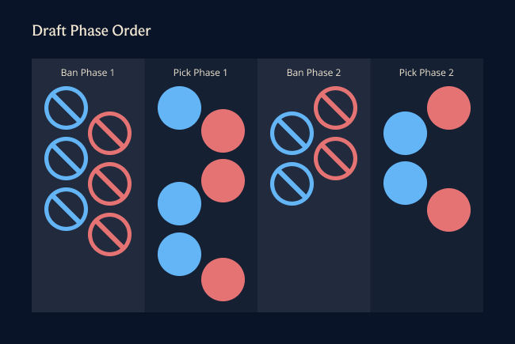
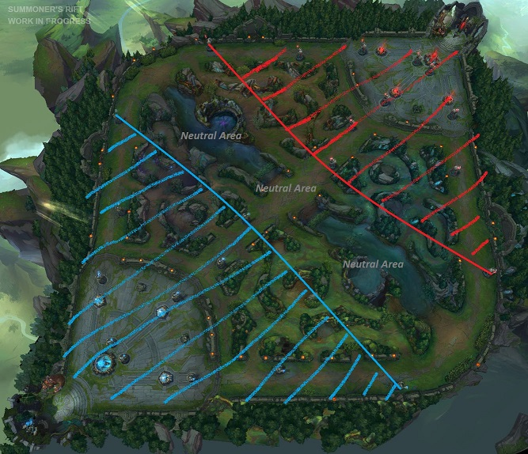

## Introduction

### Game Overview

[League of Legends](https://www.leagueoflegends.com) (which we'll abbreviate as LoL for brevity) is a [multiplayer online battle arena](https://en.wikipedia.org/wiki/Multiplayer_online_battle_arena) (MOBA) game developed and published by [Riot Games](https://riotgames.com). Released in 2009, it has become one of the most popular games in the e-sports scene, attracting tens of millions of players worldwide and maintaining a strong competitive presence. In LoL, 5 players assume the role of a "champion" with unique abilities and battle against a team of 5 other players. The game's primary objective is to power up your champion through strategic gameplay, acquiring items and abilities to ultimately destroy the opposing team's "Nexus," a critical structure located within the enemy team's base. The game is known for its extremely high prerequisite knowledge requirement and skill ceiling, partially due to its maturity in the gaming industry.

### Data Overview

Within this project, the data we will work with is from [Oracle's Elixir](https://oracleselixir.com), a historical database and analytics provider for the e-sports scene within LoL. This site is utilized by both professional analysts and community enthusiasts alike, offering comprehensive match data across nearly all major leagues and competitions internationally. Oracle's Elixir provides detailed statistics on player performance, team strategies, and game outcomes, making it an invaluable resource for understanding the dynamics of professional LoL play and for conducting in-depth analyses of the game and consequently, its "metagame."

[Metagame](https://en.wikipedia.org/wiki/Metagame) (which we'll refer to as "meta" for brevity) is defined as the set of strategies, tactics, and trends that are currently dominant or popular within a competitive gaming community. It encompasses the collective understanding of the most effective ways to play the game, which can evolve over time as players discover new techniques, balance changes are implemented by developers, and the competitive environment shifts. Some examples in other games include:

- In chess, the meta includes popular opening strategies like the Sicilian Defense or the Italian Game, which players study and use because they are considered effective.
- In poker, the meta could involve trends in betting strategies or bluffing techniques that are widely adopted by players to gain an edge over their opponents.
- In Monopoly, the meta might include strategies like acquiring properties that are statistically more likely to be landed on (e.g. the orange set), because they can yield a high return on investment when developed with houses and hotels.

Within the scope of LoL, the meta is primarily defined by the champions and item "builds" that are most effective in the current competitive environment's balance. This leads to the question investigated in this project:

**How can we quantify and predict metagame shifts across different patch versions?**

Understanding and predicting metagame shifts is crucial because it directly impacts the strategies and decisions made by players, coaches, and analysts, and can provide insight as to how the development team balances the game. By staying informed about these shifts, players can maintain their competitive edge, coaches can better prepare their teams, and analysts can improve the accuracy of their game predictions.

### Data

The dataset is downloaded as a collection of `.csv` files, where each `.csv` represents one year of match data from professional LoL games. The data covers matches from 2014 up to present day (the 2024 set updates incrementally on a daily basis). Combining all of these `.csv` files into a single dataset yields a total of 994056 rows and 168 columns. Some relevant columns include:

| Column Name        | Description                                                                                                                                                                   |
| ------------------ | ----------------------------------------------------------------------------------------------------------------------------------------------------------------------------- |
| `gameid`           | A unique identifier for each game. Formatting is inconsistent across leagues.                                                                                                 |
| `datacompleteness` | Whether the data is complete, partial, or contains errors.                                                                                                                    |
| `date`             | ISO-formatted date when the game was played.                                                                                                                                  |
| `side`             | The side (blue or red) the player/team was on.                                                                                                                                |
| `position`         | The role/position of the player. One of "top", "jng", "mid", "bot", "sup", or "team" (for team-level stats).                                                                  |
| `teamname`         | The name of the team.                                                                                                                                                         |
| `playername`       | The name of the player. This entry is missing for rows pertaining to teams.                                                                                                   |
| `champion`         | The champion played by the player. This entry is missing for rows pertaining to teams.                                                                                        |
| `patch`            | The patch version of the game.                                                                                                                                                |
| `pick1` - `pick5`  | The order of champions picked by the team in the draft phase. Many older games did not record this information.                                                               |
| `ban1` - `ban5`    | The order of champions banned by the team in the draft phase. Older games have a 3-ban system, while more recent games have a 5-ban system. Some games have no bans recorded. |

Here are the first 12 rows of the dataset, which represent a single game—the first 10 rows represent the players on the blue team, and the last 2 rows represent the team-level statistics. Note that many columns are not shown for brevity:

|     | gameid             | date                | side | position | teamname    | playername | champion     |
| --- | ------------------ | ------------------- | ---- | -------- | ----------- | ---------- | ------------ |
| 0   | 10660-10660_game_1 | 2024-01-01 05:13:15 | Blue | top      | LNG Esports | Zika       | Aatrox       |
| 1   | 10660-10660_game_1 | 2024-01-01 05:13:15 | Blue | jng      | LNG Esports | Weiwei     | Maokai       |
| 2   | 10660-10660_game_1 | 2024-01-01 05:13:15 | Blue | mid      | LNG Esports | Scout      | Orianna      |
| 3   | 10660-10660_game_1 | 2024-01-01 05:13:15 | Blue | bot      | LNG Esports | GALA       | Kalista      |
| 4   | 10660-10660_game_1 | 2024-01-01 05:13:15 | Blue | sup      | LNG Esports | Mark       | Senna        |
| 5   | 10660-10660_game_1 | 2024-01-01 05:13:15 | Red  | top      | Rare Atom   | Xiaoxu     | Rumble       |
| 6   | 10660-10660_game_1 | 2024-01-01 05:13:15 | Red  | jng      | Rare Atom   | naiyou     | Rell         |
| 7   | 10660-10660_game_1 | 2024-01-01 05:13:15 | Red  | mid      | Rare Atom   | VicLa      | LeBlanc      |
| 8   | 10660-10660_game_1 | 2024-01-01 05:13:15 | Red  | bot      | Rare Atom   | Assum      | Varus        |
| 9   | 10660-10660_game_1 | 2024-01-01 05:13:15 | Red  | sup      | Rare Atom   | Zorah      | Renata Glasc |
| 10  | 10660-10660_game_1 | 2024-01-01 05:13:15 | Blue | team     | LNG Esports | NaN        | NaN          |
| 11  | 10660-10660_game_1 | 2024-01-01 05:13:15 | Red  | team     | Rare Atom   | NaN        | NaN          |

We immediately notice the dataset has some glaring issues with mixed granularity and missingness, so we turn to data cleaning before we begin with exploratory data analysis.

## Data Cleaning and Exploratory Data Analysis

### Data Cleaning

Since there are 12 rows per game, with 10 rows per match (one for each player), plus two additional rows for team-level statistics, we will need to separate these into three datasets with the following granularity levels:

- `players`: A dataset where one row represents a single player's performance in a single game
- `teams`: A dataset where one row represents a single team's performance in a single game
- `matches`: A dataset where one row represents a single game's overall statistics

The following operations were performed to clean the data:

1. We first split the dataset into `players` and `teams` DataFrames based on the `position` column (which is `team` for the team-level statistics).
2. We then removed all columns that were empty for all rows in both DataFrames, effectively removing columns that only pertain to one granularity level but not the other.
3. We then deal with miscellaneous cleaning, such as fixing the `dtype` of certain boolean columns alongside converting the `date` column to a `datetime` object. For the `patch` column, we pad it with zeroes to ensure sorting is consistent (e.g. `3.2` -> `03.02`,), and engineer a new column `major_patch` to represent the major patch version (e.g. `14.22` -> `14.X`).
4. There is a `datacompleteness` column that has three categories: "complete", "partial", and "error". The "error" category is likely due to a data collection error, so we will drop all rows with this category.
5. We also notice that a lot of the values for columns `pick1` through `pick5` are co-missing (about 24% of all rows had missing picks). In professional play, there is a "draft phase" in which the ban and pick order is actually ordinal, and alternates between the two teams with the following system:

   

   The issue is that this dataset covers games from a time before this system was implemented, and as such we have many rows where the `pick1`, `pick2`, etc. columns are all missing even though their respective `champion` entries in the `players` DataFrame are not. We can't simply use the `champion` column entries as a fallback either, because the order of champions in the `champion` column is hardcoded as their role in the game: (1) top laner, (2) jungler, (3) middle laner, (4) bottom laner, and (5) support.

   To impute these missing values, what we can do is calculate the "presence" of the champion across a particular timeframe surrounding that match (in this case, we will choose the patch number, but you can also choose a date range or a league), which is calculated as:

   $$
   \text{presence} = \frac{\text{number of games where champion was picked/banned}}{\text{number of games that patch was played}}
   $$

   For example, here is the presence rate of the top 10 champions in the 14.22 patch:

   | Champion | Presence |
   | -------- | -------- |
   | Corki    | 1.00     |
   | Aurora   | 1.00     |
   | Skarner  | 1.00     |
   | Ashe     | 0.94     |
   | K'Sante  | 0.88     |
   | Yone     | 0.71     |
   | Vi       | 0.65     |
   | Orianna  | 0.65     |
   | Varus    | 0.59     |
   | Jax      | 0.59     |

   We can then use this presence rate to determine the pick order of the champions. This is imperfect, but it should provide a good enough approximation for our purposes. One issue is that there are also games where the patch number is missing; however, we can intuit that the patch number is the same as the games surrounding it (since the data is sorted chronologically), so we can simply forward fill the missing patch numbers.

6. After imputing `pick1` through `pick5`, we create two columns that hold lists for the `picks` and `bans` for each game.
7. Finally, we create a DataFrame `matches` that consolidates the cleaned data into a single DataFrame where each row represents a single game. We prepend `blue_` and `red_` to columns that are team-specific to distinguish between the two teams' statistics. This allows us to analyze game-level statistics more effectively and ensures that each game's data is self-contained within a single row.

Here is the `.head()` of the `teams` DataFrame (with 146 columns, cherry-picked columns shown for brevity):

|     | gameid   | datacompleteness | league | ... | deathsat25 | major_patch | picks                                         | bans                       |
| --- | -------- | ---------------- | ------ | --- | ---------- | ----------- | --------------------------------------------- | -------------------------- |
| 0   | TRLH3/33 | complete         | EU LCS | ... | 10.0       | 03.X        | [Annie, Vi, Jinx, Trundle, Orianna]           | [Riven, Kha'Zix, Yasuo]    |
| 1   | TRLH3/33 | complete         | EU LCS | ... | 4.0        | 03.X        | [Thresh, LeBlanc, Lucian, Shyvana, Dr. Mundo] | [Kassadin, Nidalee, Elise] |
| 2   | TRLH3/44 | complete         | EU LCS | ... | 7.0        | 03.X        | [Elise, Lucian, Lulu, Shyvana, Kayle]         | [Lee Sin, Annie, Yasuo]    |
| 3   | TRLH3/44 | complete         | EU LCS | ... | 6.0        | 03.X        | [Thresh, Renekton, Caitlyn, Gragas, Vi]       | [Kassadin, Kha'Zix, Ziggs] |
| 4   | TRLH3/76 | complete         | EU LCS | ... | 3.0        | 03.X        | [Thresh, Gragas, Lee Sin, Shyvana, Vayne]     | [Kassadin, Annie, Orianna] |

Here is the `.head()` of the `teams` DataFrame (with 128 columns, cherry-picked columns shown for brevity):

|     | gameid   | datacompleteness | league | ... | killsat25 | assistsat25 | deathsat25 | major_patch |
| --- | -------- | ---------------- | ------ | --- | --------- | ----------- | ---------- | ----------- |
| 0   | TRLH3/33 | complete         | EU LCS | ... | 1.0       | 2.0         | 2.0        | 03.X        |
| 1   | TRLH3/33 | complete         | EU LCS | ... | 2.0       | 1.0         | 1.0        | 03.X        |
| 2   | TRLH3/33 | complete         | EU LCS | ... | 1.0       | 2.0         | 0.0        | 03.X        |
| 3   | TRLH3/33 | complete         | EU LCS | ... | 0.0       | 0.0         | 4.0        | 03.X        |
| 4   | TRLH3/33 | complete         | EU LCS | ... | 0.0       | 1.0         | 3.0        | 03.X        |

Finally, here is the `.head()` of the `matches` DataFrame (with 280 columns, cherry-picked columns shown for brevity):

|     | gameid      | datacompleteness | league | ... | red_assistsat25 | red_deathsat25 | red_picks                                     | red_bans                     |
| --- | ----------- | ---------------- | ------ | --- | --------------- | -------------- | --------------------------------------------- | ---------------------------- |
| 0   | TRLH3/33    | complete         | EU LCS | ... | 23.0            | 4.0            | [Thresh, LeBlanc, Lucian, Shyvana, Dr. Mundo] | [Kassadin, Nidalee, Elise]   |
| 1   | TRLH3/44    | complete         | EU LCS | ... | 16.0            | 6.0            | [Thresh, Renekton, Caitlyn, Gragas, Vi]       | [Kassadin, Kha'Zix, Ziggs]   |
| 2   | TRLH3/76    | complete         | EU LCS | ... | 4.0             | 4.0            | [Renekton, Vi, Leona, Ziggs, Jinx]            | [Yasuo, Elise, LeBlanc]      |
| 3   | TRLH3/85    | complete         | EU LCS | ... | 36.0            | 6.0            | [Lucian, Lulu, Shyvana, Olaf, Zyra]           | [Dr. Mundo, Yasuo, Kassadin] |
| 4   | TRLH3/10072 | complete         | EU LCS | ... | 0.0             | 8.0            | [Annie, Renekton, LeBlanc, Vi, Ezreal]        | [Evelynn, Elise, Dr. Mundo]  |

### Univariate Analysis

LoL has a roster of 169 champions (with 168 available in professional play) as of November 2024, but only a subset are considered viable in professional play during any given meta. Although a bivariate analysis is more appropriate to explore meta shifts over time (putting the `major_patch` column into the x-axis), we can still get a sense of the most "reliable" champions by looking at the top 20 most picked champions across the entire dataset. I'll color the bars by role for additional context, although this is a univariate analysis and thus it cannot be used to draw any conclusions:

<iframe
  src="assets/charts/top-20-champions.html"
  width="650"
  height="600"
  frameborder="0"
></iframe>

The data reveals Nautilus as overwhelmingly the most picked champion of all time in professional play, followed by Ezreal and Braum. Without getting too much into the particulars:

- Nautilus is a very reliable character that can provide strong engage tools and utility that allow him to set up team fights and engage targets of opportunity, which are highly valuable throughout all meta.
- Ezreal is a very difficult character with a high skill ceiling, which reaps benefits in professional play.

We can also take a look at the most banned champions across the entire dataset. In professional LoL, each team gets to ban five champions (three in older seasons) before the draft phase begins, with teams alternating bans. Banning serves several strategic purposes:

1. Target bans: Preventing a star player on the enemy team from playing their signature pick, especially if that player is known to "one-trick" that champion (i.e. they are known to play that champion very well)
2. Meta bans: Eliminating currently overpowered champions that are considered too strong in the current patch to play against. Mostly done by the blue team to immediately deny the red team a key pick
3. Composition denial: Preventing key champions that would enable certain team compositions or strategies
4. Comfort picks: Removing champions that your team struggles to play against
5. Strategic adaptation: Later bans can be used to limit the enemy team's options after seeing their initial picks

The ban phase is crucial as it sets up the draft phase and can force teams to deviate from their preferred strategies. Let's examine the most banned champions:

<iframe
  src="assets/charts/top-20-bans.html"
  width="650"
  height="600"
  frameborder="0"
></iframe>

LeBlanc is, by far and away, the most banned champion of all time. Although these results may not be indicative of the current meta, it seems as if at some point (or consistently), LeBlanc was a non-negotiable ban in professional play.

### Bivariate Analysis

Moving onto bivariate analysis, we can take a look at the distribution of gold earned by each role across the dataset. In LoL, there are five primary roles that players assume, each with distinct responsibilities and strategic importance:

| Role     | Description                                                                                                                                                                                                                                                                                                                                                                                                             |
| -------- | ----------------------------------------------------------------------------------------------------------------------------------------------------------------------------------------------------------------------------------------------------------------------------------------------------------------------------------------------------------------------------------------------------------------------- |
| Top Lane | The top laner is positioned in the top lane of the map. This player typically uses "tank" champions (characters that can absorb a lot of damage) or "bruisers" (characters that deal and withstand damage), who can initiate fights. They often play champions that excel in split-pushing (applying pressure on the map by attacking enemy structures while the rest of the team is elsewhere).                        |
| Jungle   | The jungler does not stay in a fixed lane but instead moves around the map, killing neutral monsters for gold and experience. This role is vital for map control, securing objectives like Dragon and Baron (powerful neutral monsters that provide team-wide benefits when defeated), and assisting other lanes by "ganking" (surprising enemy players in their lanes to help secure kills in outnumbered fights).     |
| Mid Lane | The mid laner occupies the central lane and is crucial for controlling the map's center. This role usually involves playing "mages" (characters that use magic to deal damage) or "assassins" (characters that can quickly eliminate opponents), champions that deal significant damage and can roam to other lanes to assist teammates in securing kills.                                                              |
| Bot Lane | The bottom lane consists of two players: the ADC (Attack Damage Carry, responsible for dealing consistent physical damage, especially in the late game) and the Support (provides utility, vision, and protection for the ADC). The bot lane is a key area for team coordination and strategy.                                                                                                                          |
| Support  | The Support is part of the bottom lane duo and focuses on protecting the ADC. This role involves providing vision control with wards (items that reveal areas of the map), engaging or disengaging fights, and playing champions with crowd control abilities (skills that impair enemy movement or actions) and healing or shielding capabilities. The Support is essential for team fights and overall map awareness. |

We can start with the gold distribution by role. Gold distribution is a key indicator of team resource allocation strategies. Different roles have different gold requirements based on their function within the team composition, and understanding these patterns helps reveal how teams prioritize their resources:

<iframe
src="assets/charts/gold-distribution-by-role.html"
width="650"
height="600"
frameborder="0"
></iframe>

The boxplot clearly demonstrates the hierarchical nature of gold distribution. Bot lane (ADC) players show both the highest median gold and largest variance, reflecting their role as primary damage dealers who require costly item builds. Mid and top laners show similar distributions, indicating comparable farm priority, while junglers trail behind slightly due to their reliance on "jungle camps" (neutral monsters in the jungle) rather than minion waves (minions that spawn in the lanes, often in higher quantities). Support players, as expected, show significantly lower gold totals, as they are less likely to engage in direct combat and farm less gold overall.

We can also analyze "vision score" across roles, which is a measure of a player's contribution to vision control on the map. LoL has a "fog of war" mechanic that obscures the vast majority of the map from view—players need to either be in a position to see the enemy, or have vision-granting items/abilities (such as wards) to see the enemy and gather information:

<iframe
  src="assets/charts/vision-score-distribution-by-role.html"
  width="650"
  height="600"
  frameborder="0"
></iframe>

Support players show dramatically higher vision scores with a wide distribution, reflecting their primary responsibility for map vision control. Junglers maintain the second-highest vision scores, which is used for securing objectives and tracking enemy movements. The relatively lower and similar vision scores among laners (top, mid, bot) suggest they focus more on farm and combat, relying on supports and junglers for primary vision control. This reveals a very concrete hierarchy between roles that is adhered to in professional play.

We can move onto analyzing the relationship between the major patch version and the average length of a game:

<iframe
  src="assets/charts/average-game-length-by-patch.html"
  width="650"
  height="600"
  frameborder="0"
></iframe>

The trend of decreasing game duration across patches likely reflects Riot Games' intentional game design changes. Through various patch updates, they have introduced mechanics that accelerate the pace of matches, such as increased gold generation, stronger objective rewards (like dragons and heralds), and changes to tower durability. These changes were probably made to speed up the game to make it both more engaging and less passive. In general, team damage has also gone up over time from a combination of both champion changes and item build changes.

### Interesting Aggregates

Here is one of the most interesting phenomenons that we can observe from the data: the win rate of the "blue side" (the side on the bottom left half of the map) is significantly higher than the win rate of the "red side" (the side on the top right):

| Side | Win Rate | First Blood | First Dragon | First Herald | First Tower | First Baron |
| ---- | -------- | ----------- | ------------ | ------------ | ----------- | ----------- |
| Blue | 53%      | 51%         | 44%          | 56%          | 55%         | 49%         |
| Red  | 47%      | 49%         | 56%          | 39%          | 45%         | 46%         |

There are a couple reasons why it might be the case that the blue team has a higher win rate:

- In the draft phase: if the state of the meta involves an overpowered champion with no true counter, the red team is forced to either ban the champion or allow the blue team to pick it with no trouble. It's good to note that in balanced patches the red team actually has an advantage in the draft phase because they have the first counterpick.
- In the map layout: as evident from the above aggregate statistics, the blue team is more likely to secure the Rift Herald/Baron Nashor objectives (located in the same pit) due to the placement of walls on the map. Although the red team is significantly more likely to secure the Dragon objective, the Dragon is objectively riskier to fight due to its difficult-to-dodge attacks. Three players on the bottom half of the map (the jungler, ADC, and Support) also risk instigating a large team fight if they attempt to fight the Dragon.
- Ganking opportunities: the blue side has shrubbery in the jungle which allows for surprise attacks on the red team's top laner, while the red team has shrubbery that allows for surprise attacks on the blue team's bottom laners. Although this seems like an equal advantage, the issue is that the top lane only has a single player (which makes it difficult to escape a gank) while the bottom lane has two players that can help each other escape. As such, there are particular champions on the top lane that have significantly higher win rate disparities between the two sides.
- Camera placement: the camera angle in LoL is not a perfect top-down view of the map, but rather angled such that the blue side is slightly closer to the viewer (as shown in the figure above), which improves visibility for the blue team. This is the biggest disadvantage of the red side.

## Assessment of Missingness

### NMAR Analysis

Based on analysis of the data, none of the columns in the dataset appear to be NMAR (Not Missing At Random). This conclusion stems from understanding the data generating process itself—when data is missing, it is typically due to:

1. Technical issues during data collection
2. Changes in how statistics are tracked between patches
3. Inconsistencies in data reporting from different tournaments/regions

In all these cases, the missingness mechanism is independent of the missing values themselves. For example:

- When ban data is missing, it's not because certain champions were banned
- When vision score data is missing, it's not because players scored particularly high or low
- When gold distribution data is missing, it's not because of extreme wealth disparities

The missingness is instead explained by observable factors like the tournament region, time period, or data collection methodology—making the data MAR (Missing At Random) rather than NMAR.

### Missingness Dependency

For this analysis, we need to carefully consider how to select a column with non-trivial missingness. In this dataset, we observe that many columns tend to be missing together in groups (for example, all ban-related columns are typically missing simultaneously). Rather than arbitrarily selecting one of these co-missing columns, we can leverage the dataset's `datacompleteness` indicator column, which marks whether each game's data is fully complete or partial (recall that there was also an "error" category that was once possible in this column, but all rows with this category were dropped). By analyzing how well this indicator aligns with actual missing data patterns, we can validate it as a reliable proxy for missingness. If validated, we can use this indicator column for our permutation tests instead of individual missing columns, giving us a more meaningful measurement of missingness.

In order to validate the `datacompleteness` indicator as a proxy for missingness, we create a table that shows the percentage of data that is missing for each column, separated by whether it is marked as 'complete' or 'partial'. To quantify the disparity in missingness between complete and partial data, we engineer a new feature `disparity_score` for each column using the formula:

$$
  \text{disparity score} = \frac{\text{prop. missing in partial data} - \text{prop. missing in complete data}}{1 + \text{prop. missing in complete data}}
$$

This score helps us understand which columns are most affected by incomplete data collection, and is interpretable as such:

- A score close to 1 indicates the column is usually present in complete data but missing in partial data
- A score close to 0 indicates similar missingness between complete and partial data
- A negative score would indicate more missingness in complete data than partial data (which would be unusual)

The following table shows the disparity scores for each column, with there being 146 rows in total for each column:

| Column Name            | % Missing in Complete Data | % Missing in Partial Data | Disparity Score |
| ---------------------- | -------------------------- | ------------------------- | --------------- |
| clouds                 | 0.00                       | 0.99                      | 0.99            |
| oceans                 | 0.00                       | 0.99                      | 0.99            |
| elders                 | 0.00                       | 0.99                      | 0.99            |
| ...                    | ...                        | ...                       | ...             |
| monsterkillsownjungle  | 0.41                       | 0.02                      | -0.28           |
| url                    | 0.39                       | 0.00                      | -0.28           |
| dragons (type unknown) | 0.96                       | 0.01                      | -0.48           |

We arbitrarily bucket the disparity scores into five categories: "Very High" ($> 0.8$), "High" ($> 0.5$), "Moderate" ($> 0.2$), "Low" ($\geq 0$), and "Negative" ($< 0$):

| Disparity Score Range | Count |
| --------------------- | ----- |
| Very High ($>0.8$)    | 79    |
| High ($>0.5$)         | 3     |
| Moderate ($>0.2$)     | 12    |
| Low ($\geq 0$)        | 43    |
| Negative ($< 0$)      | 9     |

As we can see, the vast majority of columns fall into the "Very High" category, with the "Low" bucket trailing behind and the "Moderate" and "High" categories low in frequency. Disturbingly, there are columns that fall into the "Negative" category, which would indicate that the column is more likely to be missing in complete data than partial data. Taking a look at these:

| Column Name             | % Missing in Complete Data | % Missing in Partial Data | Disparity Score |
| ----------------------- | -------------------------- | ------------------------- | --------------- |
| teamname                | 0.00                       | 0.00                      | 0.00            |
| game                    | 0.00                       | 0.00                      | 0.00            |
| teamid                  | 0.01                       | 0.01                      | -0.01           |
| split                   | 0.23                       | 0.11                      | -0.10           |
| total cs                | 0.96                       | 0.65                      | -0.16           |
| monsterkillsenemyjungle | 0.41                       | 0.02                      | -0.28           |
| monsterkillsownjungle   | 0.41                       | 0.02                      | -0.28           |
| url                     | 0.39                       | 0.00                      | -0.28           |
| dragons (type unknown)  | 0.96                       | 0.01                      | -0.48           |

Looking through these columns, each are most likely an result of changes to either the game or the data collection process. For example, `dragons (type unknown)` is likely an artifact of the data collection process not yet specifying what type of dragon was slain, so it was categorized as "unknown." In general, these columns are most likely statistics that were not tracked in older matches, so they are marked as "complete" (since that's all that was available at the time) despite lacking newer metrics that were introduced to the data collection process later in the game's lifespan.

However, since the overwhelming majority of columns fall into the positive realm of disparity scores (meaning that the column is more likely to be missing in partial data), we can safely say that the `datacompleteness` indicator is a reliable proxy for missingness.

Moving onto missingness dependency analysis itself, we can reason that whether the data is complete is dependent on the `league` column—this is because different leagues most likely have different practices for storing and transmitting historical match data. Below, the `DataFrame` `completeness_percentages` shows leagues that have some incomplete data (we're filtering out leagues with 100% completeness):

| League | Complete Data % | Partial Data % |
| ------ | --------------- | -------------- |
| ASCI   | 0.00%           | 100.00%        |
| LSPL   | 0.00%           | 100.00%        |
| DCup   | 26.49%          | 73.51%         |
| LDL    | 37.07%          | 62.93%         |
| LPL    | 38.25%          | 61.75%         |
| MSI    | 87.30%          | 12.70%         |
| UPL    | 90.58%          | 9.42%          |
| WLDs   | 96.71%          | 3.29%          |
| LLA    | 99.57%          | 0.43%          |
| LCS    | 99.70%          | 0.30%          |
| TCL    | 99.77%          | 0.23%          |
| LEC    | 99.81%          | 0.19%          |
| LCSA   | 99.81%          | 0.19%          |
| LFL2   | 99.85%          | 0.15%          |
| TAL    | 99.87%          | 0.13%          |
| LCK    | 99.89%          | 0.11%          |
| OPL    | 99.91%          | 0.09%          |
| LMS    | 99.92%          | 0.08%          |
| CK     | 99.93%          | 0.07%          |
| LJL    | 99.94%          | 0.06%          |

Informally, we can observe that some leagues have systematically more partial data than others (some even had "error" data that we removed). To formally test this, we can perform a permutation test to see if the missingness of data is dependent on the league. Establishing the null and alternative hypotheses, we have:

- Null hypothesis: The distribution of data completeness (complete vs. partial) is the same across all leagues, meaning any observed differences in completeness rates between leagues are due to random chance.
- Alternative hypothesis: The distribution of data completeness differs between leagues, suggesting that certain leagues systematically have different rates of complete vs. partial data collection.

For our test statistic, we can use the total variation distance (TVD) between complete and incomplete data. More intuitively, if we look at what percentage each league makes up of complete data vs. incomplete data, TVD measures how different these percentages are (e.g. if LCS makes up 30% of complete data but only 5% of incomplete data, meaning that the majority of its data is complete, that contributes to a larger TVD). The larger the TVD, the more likely we can reject the null hypothesis in favor of the alternative.

Performing the permutation test, we get the following results:

<iframe
  src="assets/charts/missingness-1.html"
  width="650"
  height="600"
  frameborder="0"
></iframe>

We have an observed TVD $= 0.9061$ and $p = 0.0010$. Assuming a significance level of 0.05, we can reject the null hypothesis—this suggests that the missingness of data is dependent on the league.

Moving on, we can perform a similar analysis on the `side` column. We have the null and alternative hypotheses:

- Null hypothesis: The distribution of data completeness (complete vs. partial) is the same for both blue and red sides, meaning any observed differences in completeness rates between sides are due to random chance.
- Alternative hypothesis: The distribution of data completeness differs between blue and red sides, suggesting that one side systematically has different rates of complete vs. partial data collection.

For our test statistic, we can again use the TVD between complete and incomplete data. Performing the permutation test, we get the following results:

<iframe
  src="assets/charts/missingness-2.html"
  width="650"
  height="600"
  frameborder="0"
></iframe>

We have an observed TVD $= 0.0000$ and $p = 1.0000$. Assuming a significance level of 0.05, we fail to reject the null hypothesis—this suggests that the missingness of data is independent of the side.

## Hypothesis Testing

In our previous analysis, we observed that the blue side has about a 3% higher win rate than the red side when looking at data across all time. Although we reasoned as to why that might be the case using domain knowledge, we want to determine if this observed difference is statistically significant. We establish the following hypotheses:

- Null hypothesis: There is no systematic difference in win rates between the blue and red sides. Any observed differences in win rates can be attributed to random variation in the data.
- Alternative hypothesis: The blue side has a systematically higher win rate than the red side, beyond what would be expected by random chance alone. This suggests that side selection provides a meaningful competitive advantage.

For our test statistic, we will be using the difference in means of win rates between the blue and red sides, as this directly measures the effect we are interested in—the impact of side selection on match outcomes. We can visualize the distribution of the test statistic under the null hypothesis:

<iframe
  src="assets/charts/hypothesis-1.html"
  width="650"
  height="600"
  frameborder="0"
></iframe>

We have an observed difference in means $= 0.0646$ and $p = 0.0010$. Assuming a significance level of 0.05, we can reject the null hypothesis—this suggests that side selection provides a meaningful competitive advantage for the blue side.

## Framing a Prediction Problem

In our earlier analysis, we analyzed how the metagame in professional LoL gameplay propagates within the data it generates. We observed champion pick and ban rates, role-specific gold distributions, and how average game durations have evolved over time. We also observed that the blue side has a systematic advantage over the red side in terms of win rate, another byproduct of meta.

Building upon this understanding, we can frame a prediction problem:

**is it possible to predict the patch version of a professional LoL match based solely on the draft picks of that match?**

To better understand this prediction problem, let's break it down into key components through a series of questions and answers:

> What type of prediction problem is this?

This is a multiclass classification problem. We are predicting an ordinal category, in this case the patch version of the game. There are 220 unique patch versions in the dataset, so we are predicting from a set of 220 classes.

> Why was this particular problem chosen?

Champion selections and bans are highly influenced by the current meta, which is shaped by balance changes in each patch (or player discoveries). Champions become more or less viable due to buffs, nerfs, reworks, or being newly introduced, leading to shifts in pick/ban rates. The presence/absence of particular champions and other statistics can therefore indicate the patch version.

> What is the model's response variable?

The response variable is the patch version of the game (e.g. "13.1", "13.2", etc).

> How will the model be evaluated?

We will use three metrics:

- Primary: Accuracy, which is more suitable than F1 score since there's no inherent punishment for type 1/2 errors.
- Secondary: Mean absolute error of predictions (encoded as incremental integers) to measure how far off predictions are when wrong. For example, if we predict patch 13.01 but the actual patch is 13.14, we are off by 13 patch versions.
- Tertiary: Accuracy of major patch version (e.g. "13.X" vs "13.14") to assess prediction of major meta shifts vs minor updates.

> Are there any "time of prediction" issues?

Since we are only using features from the draft phase, we cannot include any data that were generated in-game (e.g. who won the game, or how many kills each champion got). We can, however, include overarching metadata like league, team name, etc. if we so wish.

## Baseline Model

Let's use a question and answer format again to describe our baseline model:

> What model was chosen and what features were used?

A `RandomForestClassifier` was chosen for our baseline model. Our features consist of 168 one-hot encoded features (all nominal), each corresponding to a unique champion and indicating whether that champion was picked or banned by either team for any given match. These features are created by transforming the columns `red_picks`, `red_bans`, `blue_picks`, and `blue_bans` from our `matches` DataFrame into a one-hot encoded matrix, which we call `X` as it is our feature matrix.

The response variable (patch version) is encoded using a `LabelEncoder`, which simply assigns an incrementing unique integer to each patch version.

> How well does the model perform?

A train-test split of 80-20 was performed on the dataset, and after hyperparameter tuning (which will be discussed in the next section) the model achieves the following performance:

| Metric                        | Training       | Test           |
| ----------------------------- | -------------- | -------------- |
| Accuracy                      | 82.43%         | 68.01%         |
| Major Patch Acc.              | 98.10%         | 96.59%         |
| Mean Absolute Error (patches) | 1.0207 patches | 1.8295 patches |

> Is this a "good" model?

Our model achieves a test set accuracy of 68.01%, which is not too shabby given that there are 220 unique patches to choose from. We also are not granting any partial points for being "close" to the correct patch version, so getting the patch way off is punished the same as getting really close but not exactly right (e.g. guessing 14.19 instead of 14.20 is punished the same as guessing 03.15 instead of 14.20). Although we will still use accuracy as our evaluation metric, we can also look at the mean absolute error of our predictions to see how close they are to the correct patch version.

On average, our predictions are off by about 1.0207 patch steps (major or minor steps are both considered a single step, a slight drawback to this approach) for the training set, and 1.8295 patch steps for the testing set. If we only consider predicting a major patch, we have 98.10% accuracy on the training set and 96.59% accuracy on the testing set.

We can also graph the training and test accuracy of the model provided we give it a leniency of $n$ patch steps:

<iframe
  src="assets/charts/initial-accuracy-within-n.html"
  width="650"
  height="600"
  frameborder="0"
></iframe>

As we can see, the model's accuracy significantly increases when you give it some leniency:

- With a leniency of 1 patch step, the model has a training accuracy of ~93% and a testing accuracy of ~88%
- With a leniency of 2 patch steps, the model has a training accuracy of ~95% and a testing accuracy of ~92%

This is extraordinarily good, considering the granularity of the task and the fact that we are only encoding the presence and absence of champions. We can inch out a bit more performance on this model in the next step.

## Final Model

> What new features were added to the final model?

As of now, our model only considers the presence of the champion (whether they were picked or banned), but the model currently does not consider the order in which the champions are picked or banned. Although multiple attempts were made to incorporate the entirety of the draft phase information into the model, it seems like it introduces too much noise that the signal is drowned out and the accuracy suffers. Although the entire draft phase is available to our disposal, we will only be creating two new features: whether the champion was first picked by either team, or whether the champion was first banned by either team. This is a change that can be done to our current `transform_picks_bans` function, thus creating `transform_picks_bans_enhanced` that will be used in our final model.

> Why would these features improve the model (from the perspective of the data-generating process)?

First picks and first bans are particularly important signals in League of Legends drafting strategy. First picks are often used on champions that are considered strong in the current meta but don't have strong counterpicks, as the opposing team will have two picks to respond. First bans are typically reserved for champions that are considered overpowered or problematic in the current patch. By encoding whether a champion was first-picked or first-banned, we're capturing information about which champions were considered highest priority by teams in that particular patch. This is valuable information because patches often directly target these high-priority champions with nerfs, or introduce changes that make certain champions become high priority.

> What hyperparameters were tuned, and what method was used to tune them?

The hyperparameters for our `RandomForestClassifier` were tuned through manual experimentation and cross-validation, as a grid search would be computationally expensive given that one iteration of fitting takes about a minute to run. These were tuned when we created the initial model and remain the same for our final model:

| Hyperparameter      | Value      | Justification                                                                                                                                                                                                                                                                           |
| ------------------- | ---------- | --------------------------------------------------------------------------------------------------------------------------------------------------------------------------------------------------------------------------------------------------------------------------------------- |
| `n_estimators`      | 500        | A higher number of trees generally reduces model variance through averaging, though with diminishing returns. 500 trees provided a good balance between performance and training time.                                                                                                  |
| `max_depth`         | 16         | This was the primary focus during tuning, as we needed to find the sweet spot where the model could capture complex champion interaction patterns without overfitting. If the trees are too deep, the model will memorize specific game patterns rather than learning general patterns. |
| `max_features`      | "sqrt"     | Using the square root of features for splits helps reduce correlation between trees and prevents overfitting by introducing randomness in feature selection.                                                                                                                            |
| `min_samples_split` | 16         | Requiring a certain amount of samples to split a node ensures splits are statistically meaningful and reduces noise fitting. This works in tandem with `min_samples_leaf` to control tree growth. The value of 16 was chosen after several trials.                                      |
| `min_samples_leaf`  | 4          | Setting a minimum of 4 samples per leaf node prevents the model from creating branches based on very small subsets of data, which could represent noise rather than true patterns. The value of 4 was also chosen after several trials.                                                 |
| `class_weight`      | "balanced" | Since each patch version has varying numbers of games, balanced weights ensure the model learns equally from all patches rather than biasing toward patches with more data.                                                                                                             |

> How did this model improve relative to the baseline model?

The final model achieves the following performance, relative to the baseline model:

| Metric           | Old Model |        | New Model |        | Improvement |        |
| ---------------- | --------- | ------ | --------- | ------ | ----------- | ------ |
|                  | Train     | Test   | Train     | Test   | Train       | Test   |
| Accuracy         | 82.43%    | 68.01% | 82.74%    | 68.76% | 0.31%       | 0.75%  |
| Major Patch Acc. | 98.10%    | 96.59% | 98.21%    | 96.97% | 0.10%       | 0.38%  |
| MAE (patches)    | 1.0207    | 1.8295 | 0.9559    | 1.6002 | 0.0648      | 0.2293 |

As we can see, although the difference in improvement for accuracy and major patch accuracy is extremely small, the new model has improved MAE (as in if we're wrong, we're off by about 0.256 less patch steps on average). We can look at the $n$-step accuracy of the new model compared to the old model:

<iframe
  src="assets/charts/final-accuracy-within-n.html"
  width="650"
  height="600"
  frameborder="0"
></iframe>

This is the most I could inch out of this model, especially with the limitations of the features available (we literally only have the champion names and the draft order), the limitations of the model architecture itself (a simple random forest classifier), and the task being very granular. I am more than happy with this result.

## Fairness Analysis

For our fairness analysis, we will be determining if our model is fair to both "old" games and "new" games—that is, if we split the data down the middle by the median patch version, are we able to predict the patch version with the same accuracy for both sets?

To start, we must split the data down the middle. We create a new DataFrame `test_predictions` to store the true and predicted patch versions, as well as the inverse transformed versions for readability:

|       | true_encoded | pred_encoded | true  | pred  | error |
| ----- | ------------ | ------------ | ----- | ----- | ----- |
| 16461 | 0            | 0            | 03.15 | 03.15 | 0     |
| 5555  | 0            | 0            | 03.15 | 03.15 | 0     |
| 7559  | 0            | 0            | 03.15 | 03.15 | 0     |
| 2064  | 0            | 0            | 03.15 | 03.15 | 0     |
| 13464 | 127          | 0            | 10.14 | 03.15 | 127   |
| ...   | ...          | ...          | ...   | ...   | ...   |
| 12785 | 218          | 218          | 14.21 | 14.21 | 0     |
| 8289  | 218          | 218          | 14.21 | 14.21 | 0     |
| 13593 | 201          | 218          | 14.02 | 14.21 | 17    |
| 264   | 219          | 218          | 14.22 | 14.21 | 1     |
| 4663  | 218          | 219          | 14.21 | 14.22 | 1     |

We find the median value of `true_encoded` to be patch 11.04 when inverse transformed. We can split the data into two groups: "early" and "late" games, such that anything before patch 11.04 is considered "early" and anything after (including 11.04) is considered "late". We can then look at the accuracy of the model on each set:

| Metric           | Early Patches | Late Patches | Difference (Early - Late) |
| ---------------- | ------------- | ------------ | ------------------------- |
| Accuracy         | 69.65%        | 67.90%       | +1.76%                    |
| Major Patch Acc. | 98.33%        | 96.80%       | +1.53%                    |
| MAE (patches)    | 1.1868        | 2.0002       | -0.8135                   |

Although we could technically use the other metrics to determine fairness, we will be using accuracy as our primary metric. We can perform a permutation test to determine if the difference in accuracy is statistically significant, using difference in means as our test statistic:

<iframe
  src="assets/charts/fairness-analysis.html"
  width="650"
  height="600"
  frameborder="0"
></iframe>

We have an observed difference in means $= 0.0176$ and $p = 0.0340$. Assuming a significance level of 0.05, we can reject the null hypothesis—this suggests that the model is not fair to both "old" and "new" games. This is an intuitive result, as the game introduces more and more complexity as champions/items are added/reworked, which introduces noise for the latter half of the dataset and thus is where the model is more likely to be wrong.